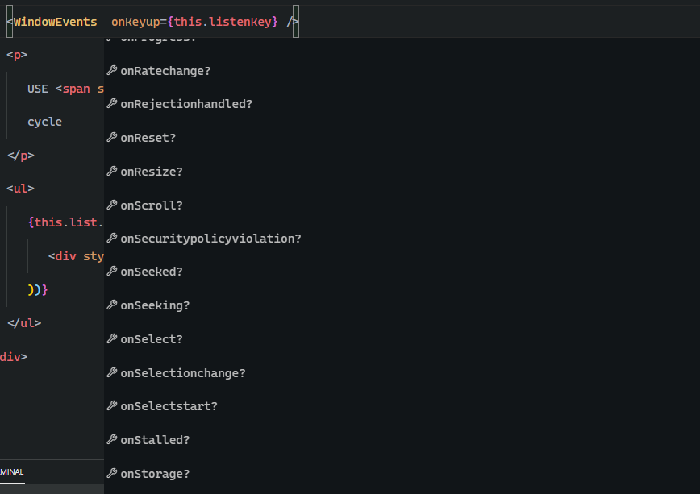
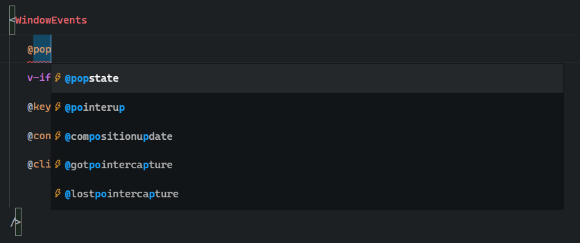

## Global window events component for vue 3

### Intallation

For npm:

```
npm install vue3-window-events
```

For pnpm:

```
pnpm add vue3-window-events
```

For yarn:

```
yarn add vue3-window-events
```

## Usage

Import the component and use like a regular component.

#### `component.vue`

```html
<template>
   <WindowEvents @keyup.tab.prevent="yesItWorks()" @click="doSomething" />
</template>

<script setup>
   import { WindowEvents } from 'vue3-window-events';
</script>
```

#### `component.tsx`

```tsx
import { WindowEvents } from 'vue3-window-events';
import { defineComponent } from 'vue';

const MyComponent = defineComponent({
   render() {
      return (
         <div>
            <WindowEvents
               onClick={(e) => {
                  e.clientX ? e.clientX : e.clientY;
               }}
               onPopState={(e) => {
                  doSomethingWith(e);
               }}
            />
         </div>
      );
   }
});
```

## What about TypeScript?

This package has built-in typescript support for emits and props, you will have no trouble while using it.



To have types support in vue files I recommend you to use `Volar` plugin. <br>
[Volar](https://marketplace.visualstudio.com/items?itemName=johnsoncodehk.volar) <br>
[TypeScript Vue Plugin](https://marketplace.visualstudio.com/items?itemName=johnsoncodehk.vscode-typescript-vue-plugin)


